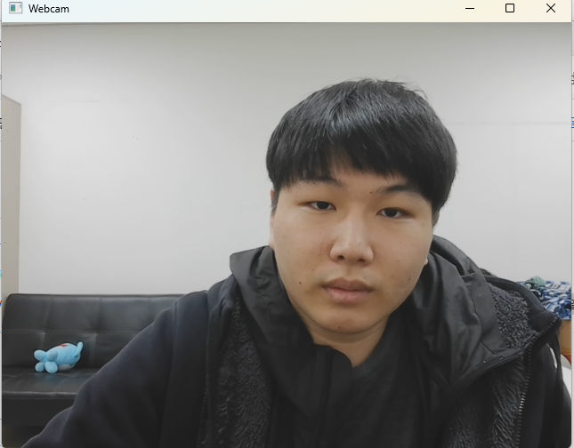
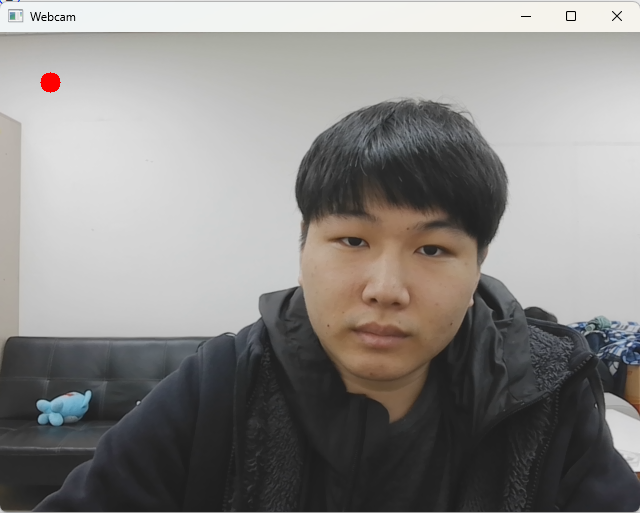
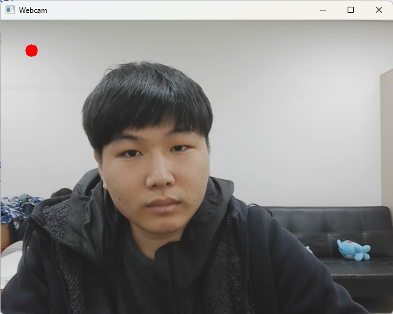

# OpenCV Webcam Recorder

이 프로젝트는 OpenCV를 사용하여 웹캠 화면을 출력하고, 동영상을 녹화할 수 있는 Python 프로그램입니다.

## 기능
- **웹캠 출력**: 기본적으로 웹캠 화면을 출력합니다.
- **녹화 기능**: `Space` 키를 눌러 녹화를 시작/중지할 수 있습니다. (녹화 중 화면에 빨간색 원 표시)
- **좌우 반전**: `M` 키를 눌러 화면을 좌우 반전할 수 있습니다.
- **종료**: `ESC` 키를 눌러 프로그램을 종료합니다.

## 실행 방법
```bash
pip install opencv-python
python main.py
```

## 키 조작
| 키      | 기능                     |
|---------|--------------------------|
| `Space` | 녹화 시작/중지           |
| `M`     | 화면 좌우 반전            |
| `ESC`   | 프로그램 종료            |

## 스크린샷
기본 화면:


녹화 중:


좌우 반전:


